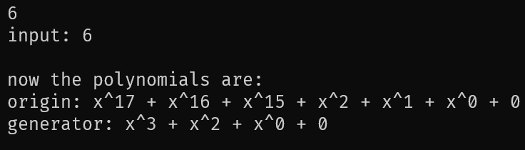

# Introduction
A simple terminal program to calculate the crc code of particular input and generation polynomials.

# Usage
In the terminal, follow the instructions on the menu to set the data to be encoded, the generation polynomial.

To set the generator polynomial recommended in the homework, type in the following command:
```6``` or ```7``` and press enter.

To set costomized generator polynomial, type in the following command:
```2``` and press enter.

For polynomial x^31 + x^3 + 1, input \"31 3 0 -1\", where -1 is the end of input.

For polynomial x^31 + x^3 + x^2 + x + 1, input \"31 3 2 1 0 -1\", where -1 is the end of input.

Similarly, press 1 to set the polynomial to be encoded.

Press 3 to see what is in the buffer.

Press 4 to encode the data.

Press 5 to quit the program.

# Example

1. Press 6 to set the generator polynomial as x^3 + x^2 + 1.
   
   

2. Press 1 to set the data to be encoded as x^4 + x^3 + x^2 + x + 1.
   
    

3. Press 4 to encode the data.

    

    It displays the remainder and the encoded data.

# Warnings

Don't press keys except the numbers on the keyboard.

# 中文版

考虑到用英语使用github copilot生成效果可能比较好，就先用英语写了,然后翻译成中文。


